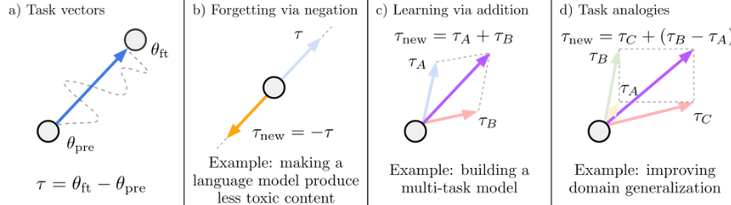
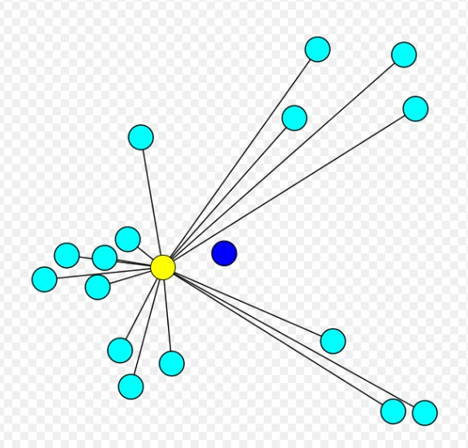

  <h1>LLM-Merging: Building LLMs Efficiently through Merging</h1>

  
  
  

This repository contains our submission for the LLM-Merging competition.

Training high-performing large language models (LLMs) from scratch is a notoriously expensive and challenging task. The **LLM Merging Competition (NeurIPS 2024 Challenge): Building LLMs Efficiently through Merging** promotes research in model merging techniques, where pretrained LLMs are fine-tuned for specific tasks and then combined to generate LLMs that can perform well across a wide variety of skills, such as reasoning, coding, math, chat, and tool use. Our submission to the competition introduces an approach that associates each pretrained LLM with a "task vector" relative to a “Base LLM”. These “task vectors” are derived from the LoRA (Low Rank Adaptation) weights of pretrained LLM's. We compute the **geometric median** of these task vectors in a high-dimensional space, applying **Weiszfeld’s iterative algorithm** and adding it to **pretrained base LLM**, effectively merging the models to generalize their capabilities and achieve state-of-the-art results on benchmark tests.

## Methodology - Our Approach

<!-- Change the size of the images here -->

  

  

  

  

###  Task Vectors

For our understanding (as mentioned in the paper), a "task" is instantiated by a dataset and a loss function used for fine-tuning. Let \( \theta_{\text{pre}} \in \mathbb{R}^d \) be the weights of a pre-trained base model, and \( \theta_{t}^{\text{ft}} \in \mathbb{R}^d \) the corresponding weights after fine-tuning on task \( t \). The *task vector* \( \tau_t \in \mathbb{R}^d \) is given by the element-wise difference between \( \theta_{t}^{\text{ft}} \) and \( \theta_{\text{pre}} \), i.e.,

\[
\tau_t = \theta_{t}^{\text{ft}} - \theta_{\text{pre}}.
\]

We focus on three arithmetic expressions over task vectors, as illustrated in Figure 1: negating a task vector, adding task vectors together, and combining task vectors to form analogies.

- **Negating a Task Vector**: When negating a task vector \( \tau \), applying the resulting vector \( \tau_{\text{new}} = -\tau \) corresponds to extrapolating between the fine-tuned model and the pre-trained model. The resulting model is worse at the target task, with little change in performance on control tasks (Figure 1(b)).
